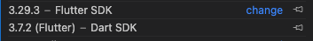
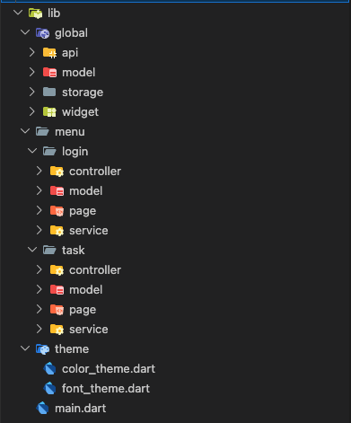
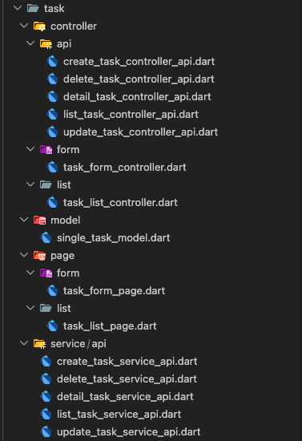

# Task Tracker app

Nama: Dimas maulana putra

## Demo Aplikasi
<video controls src="doc/video.mov" title="Title"></video>


## Cara Menjalankan Projek
1. Saya menggunakan SDK flutter `3.29.3`
2. Mohon flutter pub get 
3. Jika sudah tidak ada error, makas bisa flutter run --release atau flutter run

    

## Penjelasan Architecture
- kami menggunakan Architecture dikarenakan mempermudah jika bug fix atau membuat menu baru dikarenakan kami bedakan masing masing menu, `lib/menu`

    

    1. folder `lib/global`
        ```
        berfungsi untuk pembuat class dan function  yang berulang kami buat satu class atau function  agar bisa di panggail di menu lain, tanpa membuat lagi 
        ``` 
    2. folder `lib/theme`
        ```
        berfungsi untuk class warna dan font
        ```
    3. folder `lib/menu/login` atau `lib/menu/tugas`

        
        
        - di `lib/menu/tugas/controller`
            ```
            Saya bagi menjadi 3 folder, 
            - `lib/menu/tugas/controller/api` > berfungsi untuk pengecekan respon dari endpoint 
            
            - `lib/menu/tugas/controller/form` > semua tipe data dan logic form masuk disini

            - `lib/menu/tugas/controller/list` > semua tipe data dan logic list masuk disini
            ```

        - di `lib/menu/tugas/model`
            ```
            Saya menggunakan satu model namun sudah bisa digunakan untuk list, create, edit dan delete
            ```

        - di `lib/menu/page`
            ```
            untuk form dan list saya pisahkan dengan folder
            ```

        - di `lib/menu/service/api`
            ```
            berfungsi untuk menentukan method hit endpoint 
            ```
    
## Penjelasan State Management
- Saya memilih State Management Getx dikarenakan
    1. Cepat untuk implementasi
    2. Navigator dan show dialog bisa di letakan di controller, namun bukan menggunakan bagawaan flutter melainkan getx, 
    3. lebih ringkas untuk pindah halaman 

## Alasan memilih approach tertentu 
1. saya menggunakan ini karenakan bisa di letakan di controller tanpa harus mengirim params context, dan lebih simpel dibandingkan bawakan flutter
    ```
    Get.to(()=> TaskForm())
    ```

